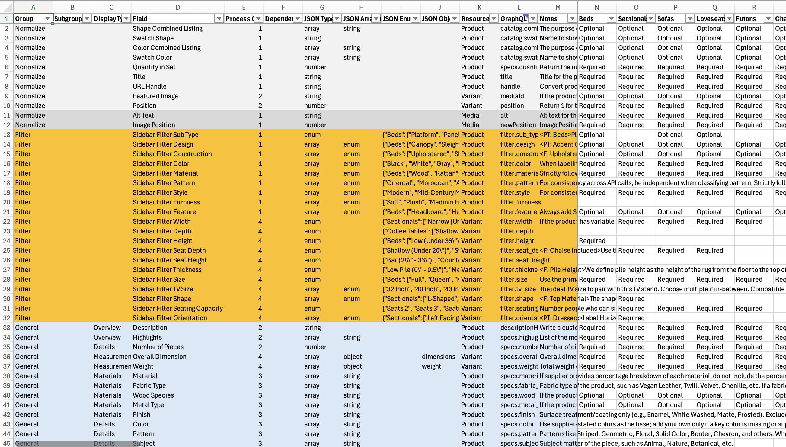
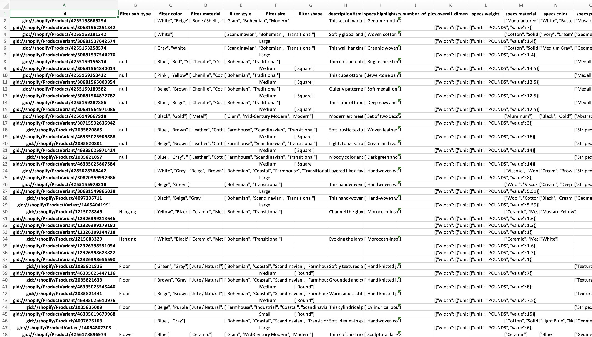

# GPT Product Data Enricher

**A multimodal, schema-driven pipeline for enriching Shopify product data with OpenAI models at catalog scale.**

GPT Product Data Enricher combines supplier data, Shopify catalog data, and product images to generate normalized product, variant, and media attributes. It is designed for enrichment tasks where literal source copying is not enough: sidebar filter labels, detailed specifications, product descriptions, image classification, image alt text, and other structured catalog fields.

The pipeline uses the OpenAI Batch API and structured outputs for large-scale, predictable processing. Most extraction behavior is configured through `fields_to_extract.xlsx`, so fields, schemas, product-type applicability, dependencies, and field-specific instructions can change without rewriting the extraction code. Currently tested and supports `gpt-6-sol` (highly recommended), `gpt-6-luna`, `gpt-5.1`, and `gpt-5` until it gets discontinued near end of 2026.

> [!NOTE]
> This is production-oriented catalog tooling, not a plug-and-play Shopify app. The current implementation assumes a Shopify-oriented data model and requires your own supplier data, Shopify export/query output, field configuration, and OpenAI API key.

## How It Works

```text
Supplier CSV/XLSX ─┐
Shopify data ──────┼──> Context + field configuration ──> OpenAI Batch API
Product images ───┘                  │                         │
                                     │                         v
                                     └──────────────> staged structured outputs
                                                               │
                                                               v
                                                    combined XLSX output
                                                               │
                                                               v
                                                     Shopify GraphQL import
```

A typical run:

1. Loads supplier data, Shopify product/variant/media data, and `fields_to_extract.xlsx`.
2. Validates the field configuration before any API work begins.
3. Builds multimodal product context from supplier rows, Shopify objects, and images.
4. Processes fields in sequential `Process Order Number` stages.
5. Uses earlier boolean results to omit irrelevant dependent fields from later stages.
6. Enforces field-specific schemas through structured outputs.
7. Downloads, parses, and merges Batch API results into one XLSX workbook.

### Spreadsheet-driven configuration

`fields_to_extract.xlsx` is the main configuration layer. It controls extraction fields, schemas, process sequencing, dependencies, product-type applicability, GraphQL mappings, and field-specific instructions.



## Key Features

- **Multimodal extraction** from supplier tabular data, Shopify catalog data, and product images.
- **Product, variant, and media support**, including Shopify base fields and custom metafields.
- **Spreadsheet-driven schemas and instructions** rather than hard-coded field logic.
- **Sequential batch processing** to keep each model call focused on a smaller set of related fields.
- **Dependency-aware extraction** so irrelevant downstream fields can be skipped automatically.
- **Product-type-specific rules** using `Required`, `Optional`, or blank applicability values.
- **Conditional instruction blocks** with custom `<PT: ...>` and `<F: ...>` tags.
- **Strict structured outputs** for strings, numbers, booleans, enums, arrays, and reusable object schemas.
- **Optional cross-product context** for related products sharing the same title prefix.
- **SKU-scoped runs, batch recovery, image-file caching, and token usage tracking** for efficient iterative processing.
- **GraphQL-oriented output mapping** that separates model-friendly field names from final Shopify field names.

## Quick Start

### 1. Install dependencies

```bash
pip install openai pandas openpyxl python-dotenv requests urllib3 tiktoken Unidecode
```

### 2. Configure your API key

Store your OpenAI API key in the environment or a local `.env` file:

```bash
OPENAI_API_KEY=your_api_key_here
```

Do not commit API keys, proprietary supplier feeds, or production catalog exports to a public repository.

### 3. Add input files

Place the required CSV/XLSX files in `input/`:

- **Supplier data** — supplier attributes keyed by SKU.
- **Shopify data** — flattened product, variant, and media data from a Shopify GraphQL query/export.
- **`fields_to_extract.xlsx`** — field definitions and extraction configuration.

An optional fourth file can contain newly added or changed SKUs to limit processing to relevant product groups.

### 4. Run the pipeline

```bash
python launch.py
```

The interactive launcher prompts for the model, Batch API endpoint, source files, SKU column, processing mode, and whether to start a new run or repair a previous one.

## Configuring `fields_to_extract.xlsx`

The field workbook determines what gets extracted and how each result is represented.

| Column | Purpose |
| --- | --- |
| `Field` | Human-readable field name shown to the model. Must be unique. |
| `GraphQL Field` | Final output column used for downstream Shopify mapping. Must be unique. |
| `Resource` | Shopify object level: `Product`, `Variant`, or `Media`. |
| `Process Order Number` | Sequential extraction stage. Blank means the field is not processed. |
| `Dependency` | Earlier boolean field that controls whether this field is requested. Supports `&&`. |
| `Notes` | Field-specific extraction and normalization instructions. |
| `JSON Type` | Output type such as `string`, `number`, `boolean`, `enum`, `array`, or `object`. |
| `JSON Enum Values` | Allowed values for enum-based fields; can be product-type-specific. |
| `JSON Array Items` | Item type for array outputs. |
| `JSON Object Type` | Reusable object schema name for object outputs. |
| Product-type columns | `Required`, `Optional`, or blank to control applicability by product type. |

Before payload generation, the program validates common configuration errors including duplicate fields, duplicate GraphQL mappings, invalid dependency order, mixed resource types within a process stage, and malformed conditional-note tags.

### Process order and dependencies

Fields sharing a `Process Order Number` are extracted together. Later stages can depend on boolean results from earlier stages.

For example:

```text
Process 1: broad classification / boolean fields
Process 2: product fields gated by Process 1 results
Process 3: additional product specifications and content
Process 4: variant-level dimensions and attributes
```

A dependency can reference one field:

```text
Upholstered
```

or require multiple conditions:

```text
Upholstered && Removable Cushion
```

If a prerequisite is false, the dependent field is omitted from the later prompt and output schema rather than repeatedly returning `null`.

### Conditional notes

Use `<PT: ...>` for instructions that apply only to certain product types:

```text
<PT: Beds>
Measure bed-frame dimensions from the assembled frame rather than the mattress.
</>
```

Use `<F: ...>` when an instruction should appear only when matching field names are available for the current product type:

```text
<F: Upholstery, Fabric>
Use the visible upholstery surface when evaluating these related fields.
</>
```

`<F: ...>` keywords are matched against actual field names using case-insensitive substring matching. Curly-brace groups inside retained blocks can also resolve dynamically to matching field names:

```text
Use {Finish, Material, Color} consistently across related fields.
```

## Processing and API Behavior

The launcher currently supports both `/v1/responses` and `/v1/chat/completions` Batch API payloads.

The Responses API path is the primary workflow for image-heavy extraction. Shopify image URLs are downloaded with retry handling, uploaded through the Files API, and reused by file ID while the cached reference remains valid. Images default to low-detail processing for cost control.

The Chat Completions path remains available as a compatibility option and can use base64-encoded images or source URLs depending on batch size.

Product-level extraction can also run in either of two context modes:

- **Individual product mode** — each product is processed independently.
- **Grouped title mode** — products sharing the same first word in their title are processed together when cross-product context is useful.

Available model choices are maintained in `utils.py`. Because model behavior changes over time, benchmark representative catalog samples before committing to a large production run.

## Recovery, Artifacts, and Usage Tracking

Each run is stored under a timestamped directory. Generated payloads, raw API results, parsed outputs, errors, and image-reference caches are preserved so long-running jobs can be inspected or repaired without starting over.

```text
payloads/<timestamp>/batch_payloads_<process>.jsonl
payloads/<timestamp>/img_inputs_ref_cache.json

output/<timestamp>/batch_results_<process>.jsonl
output/<timestamp>/batch_outputs_<process>.jsonl
output/<timestamp>/batch_errors_<process>.jsonl
output/<timestamp>/batch_outputs_combined_<timestamp>.xlsx
```

When repairing a previous run, the pipeline can resubmit only missing/error work rather than rerunning successful objects. Failed product groups can also be excluded from later process stages.

The program prints local input-token estimates before submission and aggregates actual input, output, and total token usage from completed Batch API responses. This makes it easier to catch unexpectedly large payloads and measure the cost of targeted reruns.

## Output

After the final process stage, successful results are merged into one XLSX workbook:

- rows are keyed by Shopify object ID;
- columns use the `GraphQL Field` mappings from `fields_to_extract.xlsx`;
- field order follows the configuration workbook;
- failed or missing object IDs are reported separately; and
- text outputs are normalized to ASCII before export.



The workbook is intended as a reviewable handoff to a separate Shopify GraphQL mutation/import workflow.

## Repository Structure

```text
launch.py        # CLI entry point and run orchestration
generator.py     # Context assembly, prompt/schema generation, image handling
manager.py       # Batch lifecycle, recovery, results, token usage, output merging
encoder.py       # Local token estimation
utils.py         # Input loading, validation, CLI helpers, model/endpoint selection
tag_parsor.py    # Conditional note parsing and optimization
fragments.py     # Reusable structured-output object schemas
input/           # User-supplied source files
payloads/        # Generated JSONL payloads and image reference cache
output/          # Batch results, parsed outputs, errors, and merged XLSX files
```

## Scope and Limitations

- The current implementation is optimized around a Shopify home-goods catalog workflow rather than a generic ETL framework.
- Accuracy depends heavily on field definitions, product-type rules, supplier-data quality, and image coverage.
- Model outputs should be audited on representative samples before large-scale imports.
- Extraction is grounded in the supplied catalog data and images; web search is not used as an enrichment source.
- Shopify schemas and OpenAI API behavior can change, so model menus, endpoints, token accounting, and GraphQL mappings may require maintenance over time.
- The extraction pipeline produces an import-ready workbook but does not itself write enriched values back to Shopify.

## Project Status

This repository is actively developed production tooling rather than a packaged library. The architecture favors explicit configuration, reproducible batch artifacts, and conservative validation over a minimal one-command interface.
